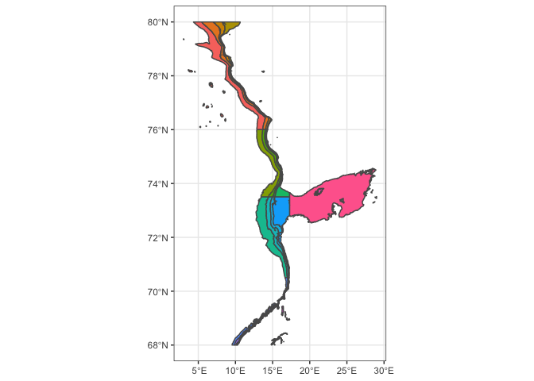
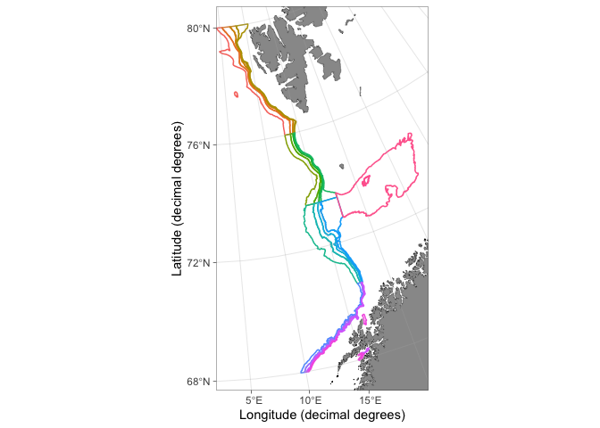
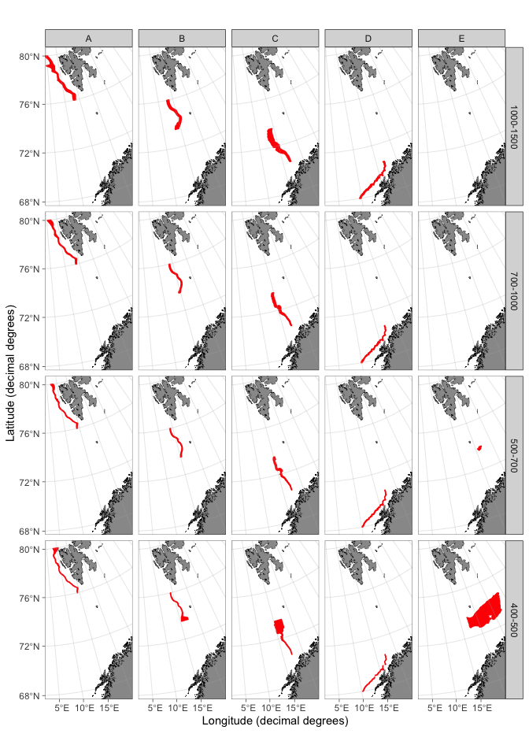
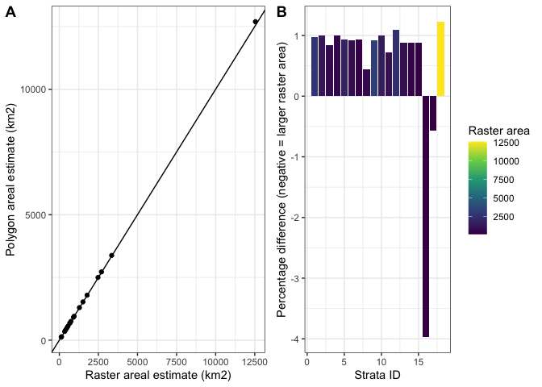

# RstoxUtils

**Utility functions for the Stox Project. R package, updated 2019-12-18.**

This package contains utility functions for the Institute of Marine Research's (IMR) Stox Project. The package has two purposes: 1) To function as a showcase and developmental platform for functions that may be included in the future releases of the Stox Project. 2) To provide a collection of functions needed in the internal workflow of the Deep-sea species group at IMR.

## Installation

The package requires [**RstoxData**](https://github.com/StoXProject/RstoxData/releases) [Stox project](https://github.com/StoXProject) packages to function. These packages can be installed by following the links for each package or using the [**devtools**](https://cran.r-project.org/web/packages/devtools/index.html) package. The **RstoxUtils** package can be installed using **devtools** once all Stox project packages are installed correctly. 


```r
devtools::install_github("MikkoVihtakari/RstoxUtils", upgrade = "never")
```

The **RstoxUtils** uses multiple GIS packages developed for R. You may have to update these (Packages -> Update -> Select all -> Install updates in R Studio). 


If the installation of a dependency fails, try installing those packages manually (using RStudio or `install.packages`).

## Usage

Each numbered section below demonstrates a separate functionality in the **RstoxUtils** package. 

### 1. Read IMR .xml files

The IMR database data are distributed as [.xml files of a certain structure](https://confluence.imr.no/display/API/Biotic+V3+API+documentation). The `RstoxData::readXmlFile` function reads these files, but due to the data architecture, information is spread across multiple data frames in the standard format. The `RstoxUtils::processBioticFile` function combines the data in station-based (`stnall` element in the list architecture) and individual fish-based (`indall`) formats. The `RstoxUtils::processBioticFiles` function does the same for multiple .xml files.


```r
xml.example <- system.file("extdata", "example.xml", package = "RstoxUtils")

standard.format <- RstoxData::readXmlFile(xml.example)
```

```
## [1] "Try to use XML namespace"
## Parsing XML: /Library/Frameworks/R.framework/Versions/3.6/Resources/library/RstoxUtils/extdata/example.xml
## Root: missions
## XML namespace: nmdbioticv3
## Using XSD: nmdbioticv3.xsd
```

```r
## The data are as a list organized under multiple data.frames
names(standard.format)
```

```
##  [1] "agedetermination"               "catchsample"                   
##  [3] "copepodedevstagefrequencytable" "fishstation"                   
##  [5] "individual"                     "mission"                       
##  [7] "missions"                       "prey"                          
##  [9] "preylengthfrequencytable"       "tag"                           
## [11] "metadata"
```

```r
## Station-based data are organized under 3 data frames
dim(standard.format$mission)
```

```
## [1]  6 11
```

```r
dim(standard.format$fishstation)
```

```
## [1] 59 74
```

```r
dim(standard.format$catchsample)
```

```
## [1] 84 36
```

```r
## Individual-based data have 2 additional data frames
dim(standard.format$individual)
```

```
## [1] 446  56
```

```r
dim(standard.format$agedetermination)
```

```
## [1] 52 39
```

```r
## The user has to merge these data frames to work with the data
## RstoxUtils addresses this issue and merges the data

library(RstoxUtils)

Utils.format <- RstoxUtils::processBioticFile(xml.example)
```

```
## [1] "Try to use XML namespace"
## Parsing XML: /Library/Frameworks/R.framework/Versions/3.6/Resources/library/RstoxUtils/extdata/example.xml
## Root: missions
## XML namespace: nmdbioticv3
## Using XSD: nmdbioticv3.xsd
```

```r
## Station-based data can now be found from 1 data frame

dim(Utils.format$stnall)
```

```
## [1] 84 56
```

```r
## The same applies for individual-based-data 
dim(Utils.format$indall)
```

```
## [1] 498  64
```

```r
## The uniting ID tags in the Utils format are
# missionid, startyear, serialno, catchsampleid and sometimes cruise for station based format
# The abovementioned and specimenid
```

*NOTE:* The `RstoxUtils::processBioticFile` function have not been modified to use the improvements made to the 0.6.3 version of the `RstoxData::readXmlFile` function yet. The modifications will make the `processBioticFile` quicker as some corrections from this function were implemented in the master function. Also, the ID tags have not been proofed yet. This note will disappear once the fixes have been made. 

### 2. Make strata for stock assessment

The question "how much fish there is in the sea?", i.e. the abundance estimation of fish within a certain area, called strata, is the heart of stock assessment. While the question itself is difficult to answer correctly, the calculus to estimate total fish abundance in given strata from trawl survey data is surprisingly simple. The formula is $N \times A$, where N is the number or weight of fish within the strata per areal unit and A the area of given strata in the same areal units than N. Since the N is multiplied by the A, the area has a large impact on the abundance estimates. Traditionally, the abundance estimation within the IMR has been done using various routines and programs with a variable level of documentation and transparency. Standardization of the routine is required and has recently been requested by both the ICES and the IMR. As a part of the standardization, the abundance estimation has to be done using Stox software. The strata have to be defined as spatial polygons (a GIS vector data class). These polygons are then used to calculate the area and to define which stations lie inside each stratum for further abundance calculation. While the determination of strata polygons is a critical part of the new routine, there are currently no standardized methods to do it. Further, trying to reproduce the areas in the previously used abundance estimation shows to be surprisingly difficult. Changes in the area estimations may dramatically change the new abundance estimates, and consequently, the estimation of strata polygons should get more attention.  

The **RstoxUtils** package contains functions to define strata based on bottom topography and geographical limits. The functions have been tested using the most known openly available bathymetry grids, [GEBCO 2019 15-arcsecond grid](https://www.gebco.net/data_and_products/gridded_bathymetry_data/) and [ETOPO1 1-arcminute grid](https://www.ngdc.noaa.gov/mgg/global/), but accept any bathymetry grid that can be rasterized using the [**raster**](https://cran.r-project.org/web/packages/raster/index.html) package. Here, I give an example of how to make strata for [North East Atlantic (NEA) Greenland halibut assessment](http://ices.dk/sites/pub/Publication%20Reports/Expert%20Group%20Report/Fisheries%20Resources%20Steering%20Group/2019/AFWG/AFWG%202019_8_greenland%20halibut%20in%20subareas%201%20and%202.pdf). 

The `RstoxUtils::strataPolygon` function defines the strata and requires a bathymetry raster file in NetCDF format. The function avoids projecting data and operates using **decimal degrees**. To follow the example, download the GEBCO grid (warning it is 11Gb). You may also use the ETOPO1 or older GECBO grids, but the areal estimations will naturally depend on the used bathymetry grid. Since GEBCO 2019 has the highest resolution of available options, we will use it in the example. 

The original strata system had been defined using latitude and depth intervals as detailed in the table below. The numbers in the cells are square nautical miles ($nm^2$; the unit ICES has chosen to use). The **RstoxUtils** package gives areas both in SI-units (square kilometers, $km^2$) and the ICES units (square nautical miles, $nm^2$). While working with the strata polygons, it is good to remember that one arcminute is approximately equivalent to one nautical mile (nm) in the latitude (y-axis) direction.  

<table class="table table-striped table-condensed" style="margin-left: auto; margin-right: auto;">
<caption>Previously used strata system definition for NEA Greenland halibut. Latitude intervals given are along rows, depth intervals along columns and the numbers represent strata areas in square nautical miles.</caption>
 <thead>
  <tr>
   <th style="text-align:left;">  </th>
   <th style="text-align:right;"> 1000-1500 </th>
   <th style="text-align:right;"> 700-1000 </th>
   <th style="text-align:right;"> 500-700 </th>
   <th style="text-align:right;"> 400-500 </th>
  </tr>
 </thead>
<tbody>
  <tr>
   <td style="text-align:left;"> 76-80 </td>
   <td style="text-align:right;"> 2693 </td>
   <td style="text-align:right;"> 1263 </td>
   <td style="text-align:right;"> 702 </td>
   <td style="text-align:right;"> 1440 </td>
  </tr>
  <tr>
   <td style="text-align:left;"> 73.5-76 </td>
   <td style="text-align:right;"> 1672 </td>
   <td style="text-align:right;"> 761 </td>
   <td style="text-align:right;"> 488 </td>
   <td style="text-align:right;"> 575 </td>
  </tr>
  <tr>
   <td style="text-align:left;"> 70.5-73.5 </td>
   <td style="text-align:right;"> 3272 </td>
   <td style="text-align:right;"> 1706 </td>
   <td style="text-align:right;"> 1324 </td>
   <td style="text-align:right;"> 1228 </td>
  </tr>
  <tr>
   <td style="text-align:left;"> 68-70.5 </td>
   <td style="text-align:right;"> 945 </td>
   <td style="text-align:right;"> 1150 </td>
   <td style="text-align:right;"> 525 </td>
   <td style="text-align:right;"> 400 </td>
  </tr>
</tbody>
</table>

To reproduce the strata system, we need to define geographic and depth limits. The `RstoxUtils::strataPolygon` function accepts these in separate arguments. The original strata system does not have longitude based limits (depth is used instead). Since we operate using bathymetry grids for the entire world, we need to limit our region down also using longitude values. The `boundary` argument in the  `RstoxUtils::strataPolygon` function clips the bathymetry grid and considerably speeds up the calculations. Let's start by defining the boundaries. You can use any map with bathymetry to eyeball the boundaries for the desired strata:


```r
library(RstoxUtils)

boundary.vec <- c(0, 29, 68, 80)
```

Now we have defined that our strata lie inside the `boundary.vec`, which defines the minimum and maximum longitude and latitude (the order is rigid) as *decimal degrees*. We can proceed in trying to reproduce the original strata. The process is iterative as small areal polygons (crumbs) and holes affect the result. The `geostrata` argument accepts data frames with four columns each defining the limits in the same order than for the `boundary` argument. Rows in the `geostrata` data frame represent different strata. 


```r
geostrata.df <- data.frame(
  lon.min = c(3, 10, 10, 8, 17.3), 
  lon.max = c(16, 17.3, 17.3, 17.3, 29), 
  lat.min = c(76, 73.5, 70.5, 68, 72.5), 
  lat.max = c(80, 76, 73.5, 70.5, 76)
)
```

Finally we need to define the depth limits for our strata:


```r
depths.vec <- c(400, 500, 700, 1000, 1500)
```

We can now proceed to estimate the strata polygons using the `RstoxUtils::strataPolygon` function. Replace the character string for `link` using the path for your GEBCO bathymetry grid (note that you need to unzip the grid after downloading). 


```r
link <- "../../../GIS/GEBCO bathymetry/GEBCO_2019/GEBCO_2019.nc"

strata.poly <- strataPolygon(bathy = link, 
                             depths = depths.vec, 
                             boundary = boundary.vec, 
                             geostrata = geostrata.df
)

# sp::spplot(strata.poly, zcol = "id") # Native plotting method

# A better one:
library(tidyverse)
library(sf)

ggplot(sf::st_as_sf(strata.poly)) + 
  geom_sf(aes(fill = as.factor(id))) +
  theme_bw() + 
  theme(legend.position = "none")
```

<!-- -->

The strata are colored based on their ID in the figure above. We notice that these strata contain small detached polygons that were not considered in the original strata definition. `RstoxUtils::strataPolygon` can get rid of such polygons, but setting the threshold values (area in $km^2$) is an iterative process and may cut unwanted parts from the polygons. At the same time, I demonstrate another way of plotting the strata on a map (although the geom_sf approach makes more sense here because it supports decimal degrees).


```r
strata.poly <- strataPolygon(bathy = link, 
                             depths = depths.vec, 
                             boundary = boundary.vec, 
                             geostrata = geostrata.df,
                             drop.crumbs = 100,
                             remove.holes = 100
)

library(PlotSvalbard)

x <- suppressMessages(suppressWarnings(broom::tidy(strata.poly)))
x <- PlotSvalbard::transform_coord(x, map.type = "panarctic", bind = TRUE)

PlotSvalbard::basemap("panarctic", limits = c("x", "lon.utm", "lat.utm"), 
                      bathymetry = TRUE, bathy.style = "poly_greys", legends = FALSE) + 
  geom_polygon(data = x, aes(x = lon.utm, y = lat.utm, color = as.factor(id), group = group), fill = NA) +
  theme(legend.position = "none")
```

<!-- -->

While it was possible to remove most small detached polygons, setting the `drop.crumbs` argument any higher would remove strata polygons we are interested in. The `boundary` argument also supports spatial polygons, which can be drawn by hand using the QGIS software. We load an example boundary shape:


```r
boundary.path <- system.file("extdata", "boundary_shape.shp", package = "RstoxUtils")

bound.poly <- rgdal::readOGR(boundary.path, verbose = FALSE)

ggplot() + 
  geom_sf(data = sf::st_as_sf(strata.poly), aes(fill = as.factor(id))) +
  geom_sf(data = sf::st_as_sf(bound.poly), fill = NA) +
  theme_bw() + 
  theme(legend.position = "none")
```

<!-- -->

The figure above shows the strata together with a customly defined boundary shape. We can now use the boundary shape to limit our strata. Since we introduce a new way of removing small detached areas, we can push the `drop.crumbs` argument a little bit down to include as much of the narrow contours of the continental slope as possible into our strata estimates. Note that you can use either the path to the shapefile or the `SpatialPolygonsDataFrame` object itself to define the boundary:


```r
strata.poly <- strataPolygon(bathy = link, 
                             depths = depths.vec, 
                             boundary = boundary.path,
                             geostrata = geostrata.df,
                             drop.crumbs = 10,
                             remove.holes = 100
)

## Modify the strata polygons
tmp <- sf::st_as_sf(strata.poly)
tmp$interval <- factor(tmp$interval, levels = unique(tmp$interval))

## Add land
data("shapefiles_panarctic", package = "PlotSvalbard")
land <- PlotSvalbard::clip_shapefile(arctic, c(0, 40, 66, 81)) %>% 
  st_as_sf() %>% 
  st_transform(crs = "+proj=longlat +datum=WGS84 +no_defs +ellps=WGS84 +towgs84=0,0,0")

## Make ID labels for the plot
id.labels <- data.frame(geostrata.name = rep(LETTERS[1:5], each = 4), interval = levels(tmp$interval), id = c(1:16, NA, NA, 17, 18))

ggplot(tmp) + 
  geom_sf(fill = "red", color = "red") +
  geom_sf(data = land, color = NA) + 
  geom_text(data = id.labels, aes(x = 25, y = 80, label = id), fontface = 2) + 
  facet_grid(interval ~ geostrata.name) + 
  theme_bw() + 
  theme(legend.position = "none") +
  coord_sf(xlim = sf::st_bbox(tmp)[grepl("xm", names(sf::st_bbox(tmp)))],
           ylim = sf::st_bbox(tmp)[grepl("ym", names(sf::st_bbox(tmp)))]) +
  theme(axis.title = element_blank())
```


Now that we have the strata polygons, we can begin examining their area. Polygonization, required by many practical GIS approaches, is essentially making a model of the underlying raster data. Such modeling always introduces a bias. Whether the bias is large enough to matter depends on the specific problem. In our case, we have polygonized fairly steep continental slope using a 15-arcsecond bathymetry grid (remember that the resolution is approximately 0.25 nm along the latitude axis). The `RstoxUtils::strataArea` function estimates areas directly from the bathymetry grid without polygonization and is useful in assessing the magnitude of bias introduced by polygonization. Even though the function supports boundary polygons, it does not remove the small detached areas and holes. This makes the polygonized strata to have higher areal estimates than the raster area if `remove.holes` argument is used and lower estimates if `drop.crumbs` is used. The effect depends on the threshold area for hole and crumb removal. 


```r
rast.area <- strataArea(bathy = link, 
                        depths = depths.vec, 
                        boundary = boundary.path, 
                        geostrata = geostrata.df)

names(rast.area)[names(rast.area) == "area.nm2"] <- "rast.area"

# Note that the area information is behind @data:
poly.area <- strata.poly@data

names(poly.area)[names(poly.area) == "area.nm2"] <- "poly.area"

x <- left_join(poly.area[!names(poly.area) %in% "area.km2"], 
          rast.area[!names(rast.area) %in% "area.km2"]
)

x$pr.diff <- 100*(x$poly.area-x$rast.area)/x$rast.area

p1 <- ggplot(x, aes(x = rast.area, y = poly.area)) + 
  geom_abline(slope = 1, intercept = 1) + 
  geom_point() +
  xlab("Raster areal estimate (km2)") +
  ylab("Polygon areal estimate (km2)") +
  theme_bw()

p2 <- ggplot(x, aes(x = id, y = pr.diff, fill = rast.area)) + 
  geom_col() +
  scale_fill_viridis_c("Raster area") +
  xlab("Strata ID") + 
  ylab("Percentage difference (negative = larger raster area)") +
  theme_bw()

library(cowplot)
cowplot::plot_grid(p1, p2, labels = "AUTO")
```

<!-- -->

We notice that polygonizing makes a minimal difference except for strata ID 16, which is a 400-500m stratum along the steepest part of the continental slope outside the North-Norwegian coast. This is an issue and arises from the resolution of our underlying bathymetry grid: the 400-500m contour is represented by single pixels in this region. These pixels get polygonized as separate polygons and consequently get removed by the `drop.crumbs` procedure. One can try to adjust the parameters more optimally or improve the `strataPolygon` function, but for now we will ignore this problem and continue comparing our polygonized strata with the original strata areas. 


```r
data("nea_ghl_original_strata") # Load the original strata areas

x <- left_join(poly.area[!names(poly.area) %in% "area.km2"], 
          nea_ghl_original_strata)

x <- na.omit(x)

x$pr.diff <- 100*(x$poly.area-x$orig.nm2)/x$orig.nm2

p1 <- ggplot(x, aes(x = orig.nm2, y = poly.area)) + 
  geom_abline(slope = 1, intercept = 1) + 
  geom_point() +
  xlab("Original areal estimate (km2)") +
  ylab("Polygon areal estimate (km2)") +
  theme_bw()

p2 <- ggplot(x, aes(x = id, y = pr.diff, fill = average)) + 
  geom_col() +
  scale_fill_viridis_c("Average depth") +
  xlab("Strata ID") + 
  ylab("Percentage difference (negative = larger original area)") +
  theme_bw()

library(cowplot)
cowplot::plot_grid(p1, p2, labels = "AUTO")
```

<!-- -->

We see straight away that there are some considerable differences. The Pearson correlation between the original and new strata areas is only 0.88, which is low since we want to try to replicate the original areas. We notice that the largest offsets are for strata IDs 4, 12, 14 and 16. All of these strata, except number 14 are the shallowest 400-500 m interval. 

STILL UNDER DEVELOPMENT.

#### Export strata polygons to Rstox.

Currently, Rstox requires strata for stock assessment in [Well Known Text (WKT)](https://en.wikipedia.org/wiki/Well-known_text_representation_of_geometry) format. Writing to this format can be done using functions provided in the [FDAtools](https://github.com/Sea2Data/FDAtools/blob/master/stoxReca/stratafiles/stratafiles.R) package (another developmental) Stox project package:


```r
#' Writes sp::SpatialPolygonsDataFrame as Stox-WKT files (stratafiles)
#' @param shape sp::SpatialPolygonsDataFrame stratadefinition to convert
#' @param output filename to save output to
#' @param namecol character string specifying the column in shape that contains strata names
writeSpDataFrameAsWKT <- function(shape, output, namecol){
  
  if (file.exists(output)){
    stop(paste("File", output, "exists already."))
  }
  
  projection="+proj=longlat +ellps=WGS84 +datum=WGS84 +no_defs +towgs84=0,0,0"
  shp <- sp::spTransform(shape, sp::CRS(projection))
  
  f<-file(output, open="w")
  
  for (i in 1:nrow(shp)){
    poly <- shp[i,]
    write(paste(as.character(poly[[namecol]]), rgeos::writeWKT(poly, byid = F),sep="\t"), f)
  }
  close(f)
  
}

#' Writes sp::SpatialPolygons as Stox-WKT files (stratafiles)
#' @details 
#'  strata names are assumed to be found in the ID slot of spatialPolygons
#' @param shape sp::SpatialPolygonsDataFrame stratadefinition to convert
#' @param output filename to save output to
writeSpAsWKT <- function(shape, output){
  stratanames <- sapply(methods::slot(shape, "polygons"), function(x) methods::slot(x, "ID"))
  stratanames.df <- data.frame( ID=stratanames, row.names = stratanames)
  areaPolygons <- sp::SpatialPolygonsDataFrame(shape, stratanames.df)
  writeSpDataFrameAsWKT(areaPolygons, output, "ID")
}

writeSpDataFrameAsWKT(strata.poly, "Ghl strata.txt", "id")
```

## Contributions and contact information

Any contributions to the package are more than welcome. Please contact the package creator Mikko Vihtakari (<mikko.vihtakari@hi.no>) to discuss your ideas on improving the package or place a request in the issues section. 

## News
2019-12-16 The first version of the package online. Bugged as life, but available. Please excuse me for not having double-checked all references to other people's work. The references will come in future releases. 
